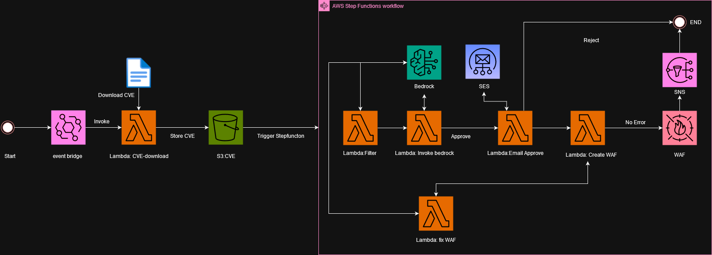
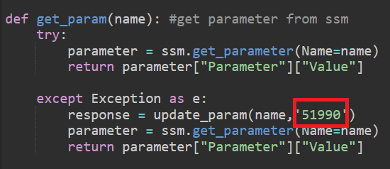
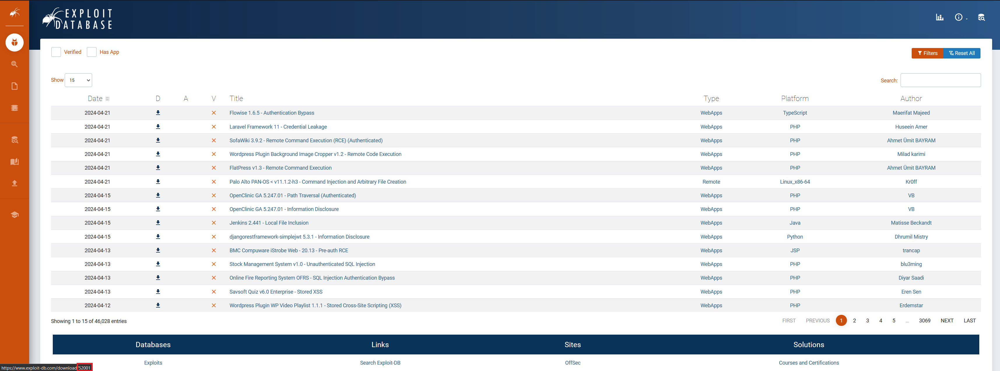
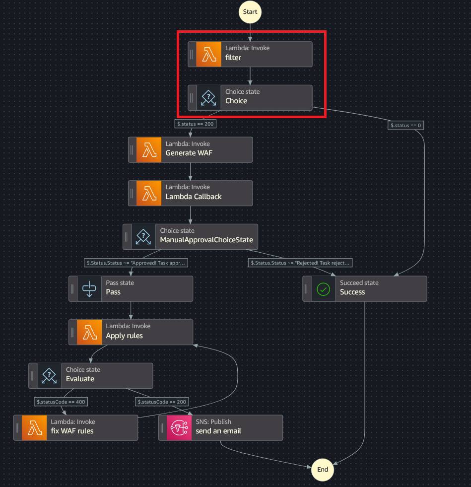
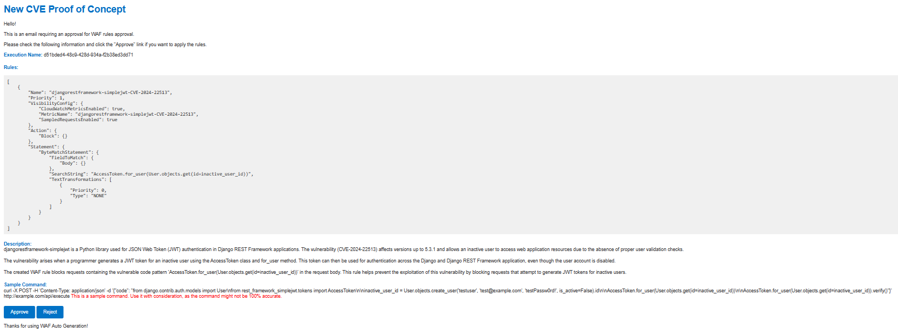
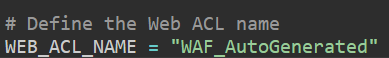

# aws-waf-auto-generate-cloudformation
### Disclaimer ⚠️⚠️⚠️
This project is a demonstration of how generative AI can be intregrated with cyber security. We as a developer of the project do not recomend you to use this project with out any understanding of the system, since doing so can cost a lot of money. This project is decided to reduce workloads of cyber security team, which could also help prevent your system from known exploitation before the system patching can be done.
### project Concept 📖
This project utilized amazon Bedrock which is a foundation model in order to generated aws WAF using Common Vulnerability and Exploit or CVE as an input to create a virtual patching for your website or service. These project is a prove of concept that Generative AI can be implement with cyber security fields to strengthen defense and reduce workload or overhead for cyber security team.
## Architect 🛠️🔧


## Requirement 

- [Python 3.12](https://www.python.org/downloads/), installed
- [AWS Command Line Interface (AWS CLI)](https://docs.aws.amazon.com/cli/latest/userguide/install-cliv2.html) version 2, installed
- [AWS Serverless Application Model (SAM)](https://docs.aws.amazon.com/serverless-application-model/latest/developerguide/serverless-getting-started.html), installed
- ❗❗❗Access to claude 3 sonnet model. If you wish to use other model on bedrock you can do so, but you will need to edit all lambda that need to access the foundation model using bedrock to model of your desire❗❗❗

### Installation ⬇️

The CloudFormation stack must be deployed in the AWS region us-east-1

```
cd deploy
git clone https://github.com/siraphopfufu/aws-waf-auto-generate-cloudformation.git
sam build
sam deploy --guided
```
After that input your Email(the input Email should also be an identity on amazon SES) and Owned Resource on system ie. application (not input anything will result in system recognize you have everythings) **AWS region that this project currently work is us-east-1

### How the system works 📑

1. After deployed the project into your account a s3 bucket, a step function, lambda functions, and eventbridge rules will be created
2. You can disable ScheduleRule if you not wish to download CVE every 24 hours, you can run the lambda function DownloadCVEFunction to download CVE.
3. Please check the CVE download number on [Exploit DB](https://www.exploit-db.com/) and edit value in exception ('51990') <br />
 <br /> <br /> 
to match the file you wanted to start dowload you can doing so by hovering your cursor on download icon. <br /><br /> 
 <br />
4. if you wish to do it all manually you can upload the .txt file directly to the bucket 'waf-auto-generate-bucket' that is created on your account. The event will trigger the stepfunction. Removing the filter lambda function, since it the flow will be reject if inputed resource is not in your resource list 
5. After the WAF rules is generated from bedrock it will send you an Email to your address 
the Email included:
- WAF rules generated
- Approve and Reject button (clicking approve will immedietly apply the generated WAF rules)
- The describtion about WAF rules and exploit
- Sample command to test vulnerability (might not be 100% accurate)

6. If clicked approve it will try to apply the rules to newly created or Existed Web ACL. Which could be apply to your load balancer, cloudfont, etc. We suggest create one rule on Web ACL, create Web ACL named "WAF_AutoGenerated", or change this parameter into your already existed web ACL in ApplyWAF lambda function. <br />

7. If applying the rule(s) has an error it will retry by asking bed rock to fix. This process will keep trying up to 3 times.
8. It will then send an Email using SNS Topic to user that the WAF rule(s) were applied or not and what error does it has if error is occur.